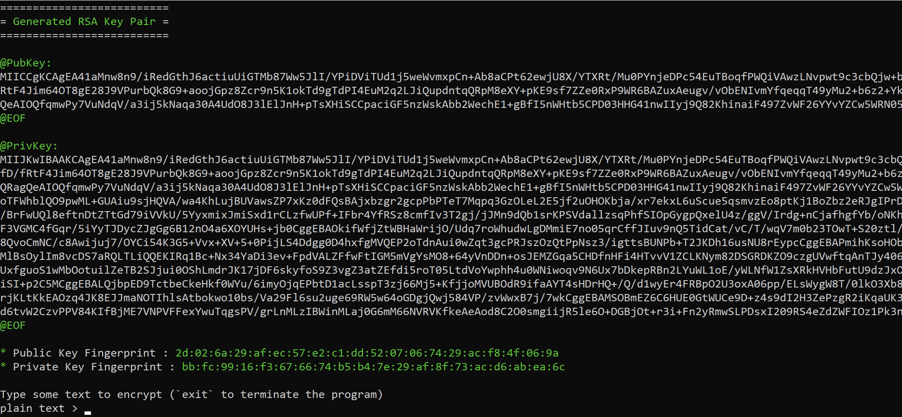
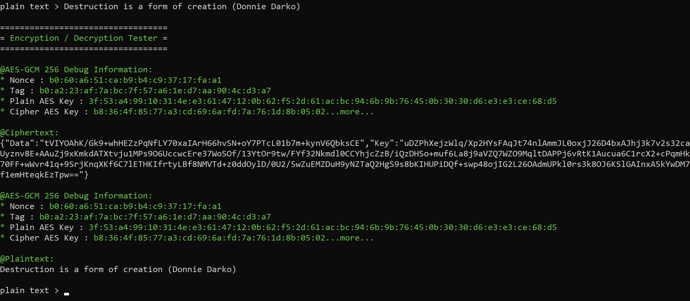

# SharpFtpC2 (PoC)

SharpFtpC2 is a small, experimental project aimed at exploring the possibility of using FTP(S) for relaying commands and responses between two remote computers. It employs the FTP protocol as a makeshift tunnel through which the computers, both acting as clients connected to an FTP server, can communicate. A simple session management scheme is used to keep track of the exchange of requests and responses.

SharpFtpC2 employs a basic session management system. Although quite elementary, it serves the purpose of keeping the communications synchronized and related, which is essential for the back-and-forth between the remote systems.

It's worth noting that this project can be effortlessly ported by utilizing version control systems such as git, svn, or similar protocols.

If you have an interest in the nitty-gritty of network communication, or just want to fiddle with C# and .NET Core, SharpFtpC2 might be an intriguing starting point. Don't expect a polished gem, but maybe, just maybe, you might learn something interesting from tinkering with it.

*SharpFtpC2 is an experimental project created for educational exploration into utilizing FTP(S) as a communication channel between two remote computers. It's crucial to understand that the project is designed as a learning resource for individuals interested in network communication, C#, Adversary Simulation, Red Team, Malware. As the creator, I urge users not to make requests for additional functionalities or use this project for any form of weaponization or malicious intent. The core intention is educational, and users are expected to engage with the content responsibly and ethically.*

---

## The Story Behing The Project

SharpFtpC2 was born out of the desire to contribute to the [Unprotect Project](https://unprotect.it), particularly its [Network Evasion](https://unprotect.it/category/network-evasion/) category. 

This idea of using FTP as a "tunnel" has roots that run deep. In fact, it brings back fond memories from around 2005 when I was still getting my feet wet in the programming world. Back then, I crossed paths with a remarkably creative French individual who went by the moniker **BlasterWar**. He had conceived a project named **BlasterX**, which, despite being lost to time, was rather avant-garde for its era. 

BlasterWar's ingenuity in his project was to provide an alternative to the conventional reverse connection, where the agent needed to establish a connection back to the controlling or hacking device.

Instead, BlasterWar opted to use FTP (File Transfer Protocol) as the alternative medium and constructed a comprehensive Remote Access Tool around it. The Tool included features such as Screen Capture, Keylogging, and System Management, all transmitted through the FTP tunnel. At the time, FTP was widely popular and a plethora of websites offered free FTP servers to the public. This made it an ideal alternative to reverse or direct connections, which involved port forwarding. Moreover, it provided an added layer of obfuscation for the command and control (C2) as the IP address of the hacker's machine wasn't directly exposed.

Today, utilizing FTP as a tunnel is not a novel concept, as a handful of Command and Control (C2) frameworks have embraced this protocol. However, employing FTP in this manner is fraught with risks. Notably, FTP's transmission of credentials in plain text over the network, combined with the necessity for both parties to possess these credentials, makes it susceptible to a myriad of attacks. Although FTP servers have made strides in addressing these security issues by increasingly adopting FTPS, which integrates SSL/TLS encryption, this adaptation has not been a panacea for all the inherent risks.

With a touch of ingenuity and by drawing inspiration from existing protocols, it is feasible to tackle a substantial number of the existing risks. 

## Give a Try

To compile this project, you require two components: [Visual Studio](https://visualstudio.microsoft.com/?WT.mc_id=SEC-MVP-5005282) and a dependency for the controller named [CommandLineUtils](https://www.nuget.org/packages/Microsoft.Extensions.CommandLineUtils?WT.mc_id=SEC-MVP-5005282).

*As this project utilizes .NET Core, it can be compiled for various platforms with ease, without necessitating any code modifications. However, you may need to implement specific features tailored to the target platform.*

To begin testing this project swiftly, I recommend employing Docker with the [stilliard/pure-ftpd](https://hub.docker.com/r/stilliard/pure-ftpd/) image. This image supports a range of options, enabling you to rapidly set up your own FTP server with ease.

`docker pull stilliard/pure-ftpd`

### Without TLS

`docker run -d --name ftpd_server -p 21:21 -p 30000-30009:30000-30009 -e "PUBLICHOST: 127.0.0.1" -e "ADDED_FLAGS=-E -A -X -x" -e FTP_USER_NAME=dark -e FTP_USER_PASS=toor -e FTP_USER_HOME=/home/dark stilliard/pure-ftpd`

### With TLS (Recommended)

`docker run -d --name ftpd_server -p 21:21 -p 30000-30009:30000-30009 -e "PUBLICHOST: 127.0.0.1" -e "ADDED_FLAGS=-E -A -X -x --tls=2" -e FTP_USER_NAME=dark -e FTP_USER_PASS=toor -e FTP_USER_HOME=/home/dark -e "TLS_CN=localhost" -e "TLS_ORG=maislaf" -e "TLS_C=FR" stilliard/pure-ftpd`

Feel free to tailor the settings according to your requirements. However, I strongly advise against exposing this test FTP server to local or public networks. It would be more prudent to limit the exposure of this container solely to your host machine.

The `ADDED_FLAGS` option allows you to fine-tune the pure-ftpd server. Explanations for all the flags can be found [here](https://linux.die.net/man/8/pure-ftpd).

Certain flags may necessitate modifications to the functioning of the C2 protocol. For instance, if you employ the `-K` option to retain all files, the ability to delete files via FTP will be disabled. Since the current C2 protocol utilizes this feature, you might need to contemplate alternative approaches, such as file renaming or moving.

## C2 Encryption (RSA + AES)

To ensure the integrity and confidentiality of all communications between the agents and the C2, encryption has been seamlessly incorporated into the communication protocol, employing both RSA and AES-GCM 256-bit algorithms. The primary objective of this feature is to thwart the possibility of a compromised FTP server delivering malicious commands. By employing encryption, command injection is rendered impossible without access to the agent's public key. Similarly, it is not feasible to inject fake agent responses without possession of the C2's public key.

To make the process of generating your own key pairs easier (one key pair for the agent and one for the C2), I have included a third-party tool called **RSAKeyHelper** Each time you run the application, it will present you with a freshly generated pair of public and private keys, which can be utilized within the program if you opt to employ encryption.

To verify that everything operates as intended, I have also integrated a feature within the same tool that allows you to test string encryption.

## Supported Commands

* Run a shell command and echo response.
* Terminate agent process.

## Changelog

### June 09 2023 - v1.0b

- First release.

### June 16 2023 - v1.0

- Support for encryption has been introduced, utilizing RSA and AES-GCM 256-bit algorithms, to safeguard the integrity and confidentiality of communications between agents and the C2 server.

### June 21 2023 - v2.0

- Code Optimization: The codebase has been optimized for better performance.
- Protocol Improvement: The communication protocol has been enhanced and is now more modular, allowing for greater flexibility.
- Support for Different RSA Key-Pairs: C2 and agents can now operate with different RSA key-pairs, enabling them to coexist without conflict on the same FTP server.
- Implementation of Dangerous Action Validation Delegate: A validation delegate has been implemented to prompt users for confirmation before executing potentially dangerous actions.

---

# Disclaimer

🇺🇸 All source code and projects shared on this Github account by Jean-Pierre LESUEUR and his company, PHROZEN SAS, are provided "as is" without warranty of any kind, either expressed or implied. The user of this code assumes all responsibility for any issues or legal liabilities that may arise from the use, misuse, or distribution of this code. The user of this code also agrees to release Jean-Pierre LESUEUR and PHROZEN SAS from any and all liability for any damages or losses that may result from the use, misuse, or distribution of this code.

By using this code, the user agrees to indemnify and hold Jean-Pierre LESUEUR and PHROZEN SAS harmless from any and all claims, liabilities, costs, and expenses arising from the use, misuse, or distribution of this code. The user also agrees not to hold Jean-Pierre LESUEUR or PHROZEN SAS responsible for any errors or omissions in the code, and to take full responsibility for ensuring that the code meets the user's needs.

This disclaimer is subject to change without notice, and the user is responsible for checking for updates. If the user does not agree to the terms of this disclaimer, they should not use this code.

---

🇫🇷 Tout les codes sources et les projets partagés sur ce compte Github par Jean-Pierre LESUEUR et sa société, PHROZEN SAS, sont fournis "tels quels" sans aucune garantie, expresse ou implicite. L'utilisateur de ce code assume toute responsabilité pour les problèmes ou les responsabilités juridiques qui pourraient résulter de l'utilisation, de l'utilisation abusive ou de la diffusion de ce code. L'utilisateur de ce code accepte également de libérer Jean-Pierre LESUEUR et PHROZEN SAS de toute responsabilité pour tous dommages ou pertes pouvant résulter de l'utilisation, de l'utilisation abusive ou de la diffusion de ce code.

En utilisant ce code, l'utilisateur accepte de garantir et de dégager Jean-Pierre LESUEUR et PHROZEN SAS de toutes réclamations, responsabilités, coûts et dépenses résultant de l'utilisation, de l'utilisation abusive ou de la diffusion de ce code. L'utilisateur accepte également de ne pas tenir Jean-Pierre LESUEUR ou PHROZEN SAS responsable des erreurs ou omissions dans le code et de prendre l'entière responsabilité de s'assurer que le code répond aux besoins de l'utilisateur.

Cette clause de non-responsabilité est sujette à modification sans préavis et l'utilisateur est responsable de vérifier les mises à jour. Si l'utilisateur n'accepte pas les termes de cette clause de non-responsabilité, il ne doit pas utiliser ce code.